<!-- ══════════════════════════════════════════════════════════════ -->
<!--  n8fury · Mamdud Hasan · Profile README                         -->
<!--  Banner: ./assets/header.svg (animated SVG, no JS)              -->
<!-- ══════════════════════════════════════════════════════════════ -->



<br/>
<br/>

## `whoami`

**Software Engineer at [Zeroozen Energy Ltd.](https://zeroozen.com)** — founding team, building the systems that power **Light Electric Vehicles (LEV)** in Bangladesh: GPS fleet telematics, battery management backends, and the data infrastructure that ties it all together.

**What I actually do day to day** — design and ship backend systems (TypeScript/NestJS + PostgreSQL/TimescaleDB), wire IoT hardware to the cloud (ESP32 → MQTT → time-series pipelines), and turn raw telemetry into decisions. Clean, efficient, built to last — code that the next engineer thanks you for.

**Outside the day job** — I run [Cloud5](https://cloud5.dev), a design & development studio: web/app builds, AI chatbots, and product consulting. Curiosity-driven, fundamentals-first.

**Let's connect** — if you're into backend architecture, EV/energy tech, or just want to argue tabs vs spaces, I'm here for it. ✨

<br/>

<details>
  <summary>🛠️ <strong>Stack & Tools</strong></summary>
  <br/>
  
  
  
  
  
  
  
  
  
  
  
  
  
  
  
  
  
  
  
</details>

<details>
  <summary>☎️ <strong>Contact</strong></summary>
  <br/>
  <p align="left">
    <a href="https://linkedin.com/in/mamdud-hasan" target="_blank">
      
    </a>
    <a href="mailto:mhjoy547@gmail.com" target="_blank">
      
    </a>
    <a href="https://twitter.com/n8fury1" target="_blank">
      
    </a>
  </p>
</details>

<details>
  <summary>📊 <strong>GitHub Metrics</strong></summary>
  <p align="left">
    
  </p>
</details>

<br/>

## 📊 Weekly Development Breakdown

<!--START_SECTION:waka-->


**🐱 My GitHub Data** 

> 📦 58.6 kB Used in GitHub's Storage 
 > 
> 🏆 333 Contributions in the Year 2026
 > 
> 🚫 Not Opted to Hire
 > 
> 📜 22 Public Repositories 
 > 
> 🔑 45 Private Repositories 
 > 
**I Mostly Code in JavaScript** 

```text
TypeScript               13 repos            ⣿⣿⣿⣿⣿⣀⣀⣀⣀⣀⣀⣀⣀⣀⣀⣀⣀⣀⣀⣀⣀⣀⣀⣀⣀   20.00 % 
HTML                     7 repos             ⣿⣿⣿⣀⣀⣀⣀⣀⣀⣀⣀⣀⣀⣀⣀⣀⣀⣀⣀⣀⣀⣀⣀⣀⣀   10.77 % 
Jupyter Notebook         3 repos             ⣿⣀⣀⣀⣀⣀⣀⣀⣀⣀⣀⣀⣀⣀⣀⣀⣀⣀⣀⣀⣀⣀⣀⣀⣀   04.62 % 
CSS                      2 repos             ⣿⣀⣀⣀⣀⣀⣀⣀⣀⣀⣀⣀⣀⣀⣀⣀⣀⣀⣀⣀⣀⣀⣀⣀⣀   03.08 % 
TeX                      1 repo              ⣀⣀⣀⣀⣀⣀⣀⣀⣀⣀⣀⣀⣀⣀⣀⣀⣀⣀⣀⣀⣀⣀⣀⣀⣀   01.54 % 
```


 Last Updated on 15/04/2026 01:27:02 UTC
<!--END_SECTION:waka-->

<!-- ── LeetCode — commencing soon, uncomment when the grind begins ──
<div align="center">
  
</div>
-->

<br/>

## 📈 Contribution Metrics

<p align="center">
  <a href="https://git.io/streak-stats">
    
  </a>
</p>

[](https://github.com/ashutosh00710/github-readme-activity-graph)

<div align="center">
  
</div>

<br/>

[](https://forthebadge.com)
[](https://forthebadge.com)
[](https://forthebadge.com)

**[⬆ back to the top](# )**

**These Readme stats are generated using**

- **GitHub Actions**
- **[Awesome Readme Stats](https://github.com/anmol098/waka-readme-stats)**  
- **[Metrics](https://github.com/lowlighter/metrics)**  
- **[GitHub Readme Streak Stats](https://github.com/DenverCoder1/github-readme-streak-stats)**
- **[GitHub Readme Activity Graph](https://github.com/Ashutosh00710/github-readme-activity-graph)**

<!-- todo -->
<!-- add snake svg from @github.com/mikyll -->
<!-- fixed snake svg push issue from @github.com/crazy-max -->
<!-- fixe wakatime ITA from @github.com/mikyll -->
